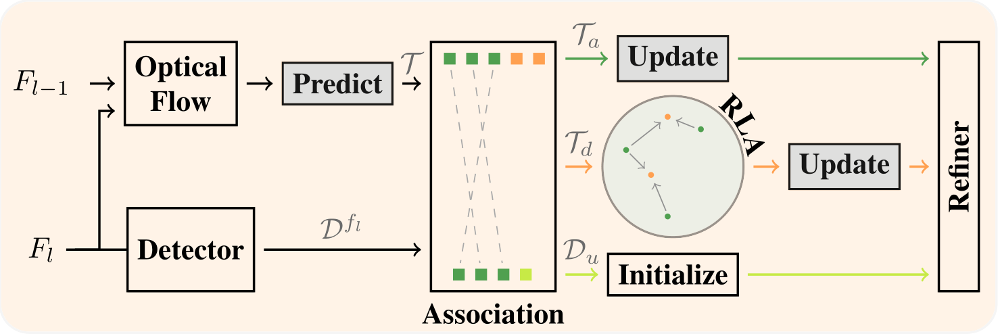

## NTrack: A Multiple-Object Tracker and Dataset for Infield Cotton Boll Counting

### Overview

In agriculture, automating the accurate tracking of fruits, vegetables, and
fiber is a very tough problem. The issue becomes extremely challenging in
dynamic field environments. Yet, this information is critical for making
day-to-day agricultural decisions, assisting breeding programs, and much more.

<p align="center">
  
</p>

This repository provides source code for our 2023 IEEE Transactions on
Automation Science and Engineering article titled "[NTrack: A Multiple-Object
Tracker and Dataset for Infield Cotton Boll
Counting](https://arxiv.org/pdf/2312.10922.pdf)." NTrack, is a multiple object
tracking framework based on the linear relationship between the locations of
neighboring tracks. It computes dense optical flow and utilizes particle
filtering to guide each tracker. Correspondences between detections and tracks
are found through data association via direct observations and indirect cues,
which are then combined to obtain an updated observation. NTrack is independent
of the underlying detection method, thus allowing for the interchangeable use
of any off-the-shelf object detector. NTrack was created for the task of
tracking and counting infield cotton bolls. To develop and test NTrack, we
created TexCot22, an infield cotton boll video dataset. Each tracking sequence
was collected from unique rows of an outdoor cotton crop research plot located
in the High Plains region of Texas. 

More information on the project can be found on the 
[NTrack website](https://robotic-vision-lab.github.io/ntrack).

### Citation

If you find this project useful, then please consider citing both our paper and
dataset.

```bibitex
@article{muzaddid2023ntrack,
  title={NTrack: A Multiple-Object Tracker and Dataset for Infield Cotton Boll Counting},
  author={Al Muzaddid, Md Ahmed and Beksi, William J},
  journal={IEEE Transactions on Automation Science and Engineering},
  volume={},
  pages={},
  doi={10.1109/TASE.2023.3342791},
  year={2023}
}

@data{muzaddid2023texcot22,
  title={TexCot22},
  author={Al Muzaddid, Md Ahmed and Beksi, William J},
  publisher={Texas Data Repository},
  version={1},
  url={https://doi.org/10.18738/T8/5M9NCI},
  doi={10.18738/T8/5M9NCI},
  year={2023}
}
```

### NTrack Pipeline 

<p align="center">
  
</p>

### Installation 

First, begin by cloning the project:

    $ git clone https://github.com/robotic-vision-lab/NTrack-A-Multiple-Object-Tracker.git
    $ cd NTrack-A-Multiple-Object-Tracker

Next, create an environment and install the dependencies:

    $ conda create --name ntrack python=3.8.
    $ conda activate ntrack
    $ pip install -r requirements.txt

### Dataset 

Download the [TexCot22](https://doi.org/10.18738/T8/5M9NCI) dataset
directories. TexCot22 consists of five ZIP files (TexCot22-[1-5]). Each data
directory has the following structure:

```
TexCot22-X/
    - train
        - img1
          - 0001.jpg
          - 0002.jpg
          - ...
        - det
          - det.txt
        - gt
          - gt.txt 
    - test
        - img1 
          - 0001.jpg
          - 0002.jpg
          - ...
        - det
          - det.txt
        - gt
          - gt.txt
```

### Usage 

To run on a test data split, invoke the following command: 

    $ python ntrack.py --data_base_dir {your/data/dir/TexCot22-X} --data_split test --use_pf True


### NTrack Source Code License

[](https://github.com/robotic-vision-lab/NTrack-A-Multiple-Object-Tracker/blob/main/LICENSE)

### TexCot22 Dataset License

[](https://creativecommons.org/licenses/by-nc-sa/4.0/)
